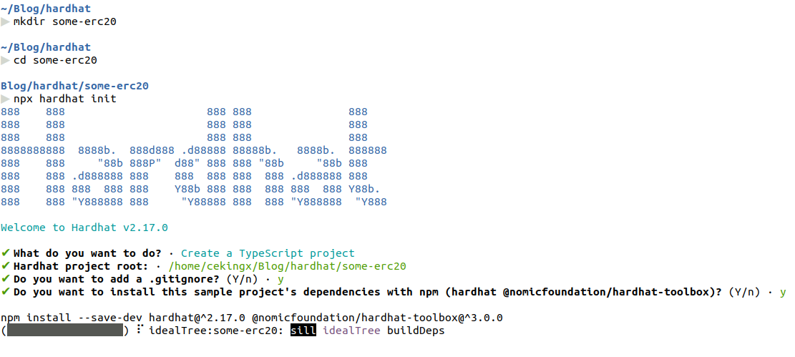
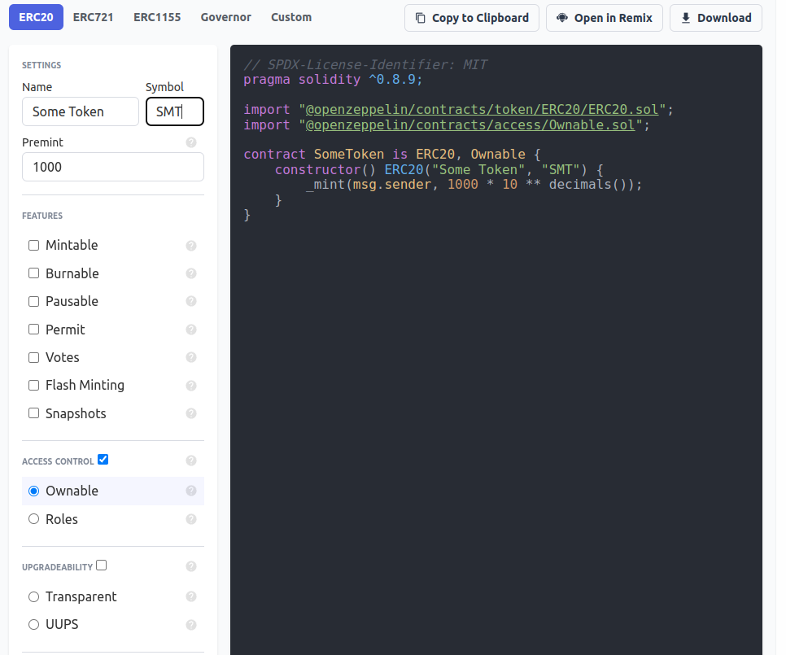

## Pendahuluan
Belakangan ini sedang banyak bermunculan blockchain-blockchain yang dapat menjalankan smart contract baik itu EVM maupun non-EVM seperti Polygon, Arbitrum, Solana, Polkadot, dll. Disamping itu komunitas dan ekosistem untuk smart contract juga berkembang pesat sehingga banyak proyek-proyek berbasis smart contract yang bermunculan. Ada beberapa macam bahasa pemrograman untuk membuat smart contract, namun untuk sekarang smart contract dengan bahasa pemrograman Solidity pada jaringan berbasis EVM masih menjadi primadona. Selain lebih mudah dipahami, ekosistem Solidity dan EVM sudah stabil dan matang sehingga lebih mudah bagi developer untuk saling berkolaborasi.

Token ERC-20 sendiri adalah standar smart contract yang dibuat berdasarkan [EIP-20](https://eips.ethereum.org/EIPS/eip-20). Secara umum standar contract ini bertujuan untuk merepresentasikan aset fungible (seperti uang) pada jaringan blockchain.

## Setup Hardhat
Buatlah sebuah project hardhat dengan menjalankan perintah
```bash
mkdir <project-name>
cd <project-name>
npx hardhat init
```

Pada project kali ini kita akan menggunakan typescript, tapi ini bisa disesuaikan dengan preferensi dan kebutuhan kalian


## Install Openzeppelin
[Openzeppelin](https://docs.openzeppelin.com/contracts/4.x/) adalah library yang digunakan untuk melakukan pengembangan smart contract yang aman karena pada library ini sudah ada contract-contract yang umum digunakan misalnya _Ownable Access Control_. Jika ingin membuat semuanya dari awal boleh saja tapi ada baiknya jika menggunakan library ini karena setiap logic pada kontrak sudah dipastikan minim bug.

Jalankan perintah
```bash
npm install @openzeppelin/contracts
```

**Untuk langkah setup hardhat dan openzeppelin yang lebih jelas bisa dilihat disini: [Cara menggunakan hardhat dan openzeppelin](https://www.youtube.com/watch?v=UPIHZYJ9n6Q)**

## Openzeppelin Wizard
Keuntungan lain dari menggunakan Openzeppelin adalah adanya [Openzeppelin Wizard](https://docs.openzeppelin.com/contracts/4.x/wizard) untuk membuat boilerplate contract yang umum seperti token ERC-20.



```solidity
// SPDX-License-Identifier: MIT
pragma solidity ^0.8.9;

import "@openzeppelin/contracts/token/ERC20/ERC20.sol";
import "@openzeppelin/contracts/access/Ownable.sol";

contract SomeToken is ERC20, Ownable {
    constructor() ERC20("Some Token", "SMT") {
        _mint(msg.sender, 1000 * 10 ** decimals());
    }

    function decimals() public override view returns(uint8) {
        return 6;
    }
}
```
Ini adalah code dari smart contract ERC-20 yang akan digunakan. Token tersebut bernama __Some Token__ dengan simbol __SMT__. Supply dari token ini adalah __1000 SMT__ yang mana jumlahnya tidak bisa ditambah maupun dikurangi. Untuk _decimals_ yang digunakan diubah menjadi 6 dimana secara default adalah 18.

## Deploy Script
Untuk melakukan deployment contract ke suatu jaringan blockchain, kita perlu membuat deployment script. Script ini bisa dibuat menggunakan javascript maupun typescript. Pada kasus kali ini akan menggunakan typescript.

```typescript
import { HardhatUserConfig } from "hardhat/config";
import "@nomicfoundation/hardhat-toolbox";
import * as dotenv from "dotenv";
dotenv.config();

const config: HardhatUserConfig = {
  solidity: "0.8.19",
  networks: {
    mumbai: {
      url: process.env.RPC_URL,
      accounts: [process.env.PRIVATE_KEY || '']
    }
  },
};

export default config;

```
Tambahkan konfigurasi network `mumbai`. `RPC_URL` bisa didapatkan pada beberapa node provider yang umum seperti  [Infura](https://www.infura.io/) dan [Alchemy](https://www.alchemy.com/). Serta pastikan account dengan `PRIVATE_KEY` tersebut sudah memiliki saldo MATIC untuk melakukan deployment. 

```bash
touch scripts/deploy-token.ts
```
Buat file baru dengan nama `deploy-token.ts` pada directory `scripts`. Nama file bisa disesuaikan dengan kebutuhan.

```typescript
import { ethers } from "hardhat";

async function main() {
	const SomeToken = await ethers.getContractFactory("SomeToken");
	const someToken = await SomeToken.deploy();

	await someToken.waitForDeployment();

	console.log(`deployed to: ${someToken.target}`);
}

main().catch((error) => {
	console.error(error);
	process.exitCode = 1;
})
```

Kemudian jalankan script ke jaringan yang diinginkan dengan cara

```bash
npx hardhat run scripts/deploy-token.ts --network mumbai
```

## Simpulan
Token ERC-20 sangat berguna untuk melakukan tokenisasi aset fungible karena cara kerjanya yang mirip seperti cara kerja uang pada dunia nyata. Bisa dicetak, diedarkan maupun dimusnahkan. Semoga bermanfaat :)