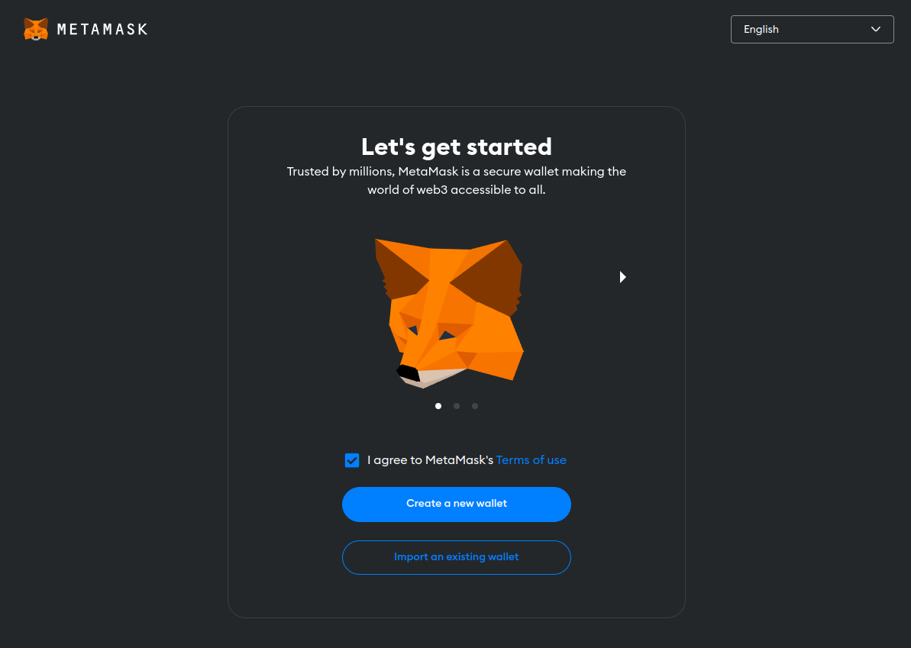

---
tags:
  - todo
  - <language>
title: "Cara Setup Private Key Untuk Deploy Ke Jaringan Mumbai"
date: 2023-09-04T21:07:23+08:00
draft: false
author: "Dirga Yasa"
showToc: true
TocOpen: false
hidemeta: false
comments: true
hideSummary: false
ShowReadingTime: true
ShowBreadCrumbs: true
ShowPostNavLinks: true
ShowWordCount: true
ShowRssButtonInSectionTermList: true
summary:
---

## Pendahuluan
Jika kita melakukan pengambangan smart contract di local misalnya hardhat, maka kita bisa melakukan deployment smart contract ke local node dengan menjalankan perintah `npx hardhat node`. Selain disediakan node, kita juga telah disediakan account(private key) yang telah memiliki balance dalam jumlah besar yang bisa digunakan untuk membayar gas fee deployment. Namun bagaimana caranya mendapatkan account untuk melakukan deployment pada sebuah jaringan blockchain publik? 

Ada beberapa cara untuk mendapatkan private key, cara yang paling mudah adalah dengan menggunakan wallet sejuta umat yaitu [Metamask](https://metamask.io/). Metamask bisa memberikan kita random seed phrase yang digunakan untuk membuat sebuah private key.

### Download Metamask
Sesuaikan dengan browser yang kalian gunakan. Untuk chrome extension ada [disini](https://chrome.google.com/webstore/detail/metamask/nkbihfbeogaeaoehlefnkodbefgpgknn)

### Onboarding Metamask

### Buat Password
Pastikan menggunakan password yang kuat dan diingat dengan baik karena tidak ada fitur __Forgot Password__

### Catat Seed Phrase
_Seed Phrase_ adalah secret yang digunakan oleh wallet provider seperti Metamask untuk generate private key. Simpan dan jaga _Seed Phrase_ dengan baik karena jika sampai pihak lain mengetahuinya maka pihak tersebut memiliki akses penuh terhadap private key yang kita miliki.

>
> __Yey kita sudah punya wallet__
>

### Fresh Wallet
Tentu saja saldo kita masih 0 karena baru saja membuat wallet

### Menambahkan Jaringan Mumbai ke Metamask
Hal yang paling mudah menambahkan sebuah jaringan ke metamask adalah melalui block explorer jaringan tersebut. Explorer untuk jaringan Mumbai adalah [https://mumbai.polygonscan.com/](https://mumbai.polygonscan.com/)

Pada pojok kanan bawah biasanya terdapat tombol _Add ... Network_. Klik tombol tersebut, akan ada pop-up untuk konfirmasi apakah yakin menambahkan jaringan tersebut atau tidak

Metamask sudah berhasil menambahkan jaringan mumbai dan membaca balance MATIC yang kita miliki

>
> __Address yang kita miliki terdapat pada tombol `0x72F...478C`__
>

### Request Faucet
Karena kita hanya menggunakan testnet maka kita bisa mendapatkan balance MATIC melalui faucet. Jika kalian menggunakan mainnet maka kalian harus membeli MATIC di exchange dan mengirimnya ke address wallet yang baru saja dibuat.
Faucet Mumbai terdapat pada [https://faucet.polygon.technology/](https://faucet.polygon.technology/)
Ketentuan meminta balance pada faucet berbeda dan berubah seiring waktu, jadi sesuaikan dengan ketentuan yang sedang berlaku

Masukkan address yang kita miliki, konfirmasi dan tunggu beberapa saat

>
> __Yey kita sudah punya balance MATIC sebesar 0.2__
>

### Export Private Key
Untuk bisa menggunakan account tersebut pada hardhat maka kita harus melakukan export private key. Private key inilah yang bisa digunakan untuk melakukan deployment smart contract.

Pilih menu _Account details_

Pilih _Show private key_

Masukkan password

>
> __Selamat kita sudah bisa membuat account yang bisa digunakan untuk deployment smart contract melalui hardhat pada jaringan mumbai__
>

### Penutup
__Seed Phrase__ dan __Private Key__ adalah hal yang sangat rahasia, jaga sebaik-baiknya jangan sampai ada pihak lain yang mengetahuinya.
Semoga bermanfaat :)